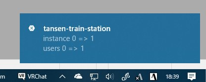

# Welcome to my World!

This watches your VRChat world and notify if someone comes!

人が出入りしたりインスタンスが立ったり減ったりすると通知が来ます。

## Install

Download from [Releases](https://github.com/Narazaka/WelcomeToMyWorld/releases).

### Windows

extract zip and run `Add-AppDevPackage.ps1` on your powershell

管理者権限でPowerShellを起動し、`Set-ExecutionPolicy RemoteSigned`を実行してから`.\Add-AppDevPackage.ps1`を実行するとたぶんインストールされます。

セキュリティのためにインストール後`Set-ExecutionPolicy Restricted`を実行して下さい。

### Android

[Google Play](https://play.google.com/store/apps/details?id=net.narazaka.welcome_to_my_world)

## Contribute

自由にプルリクエスト送ったりforkしたりして下さい。

気づかないときはTwitterに凸して下さい。

## License

[Zlib License](https://narazaka.net/license/Zlib?2018)
